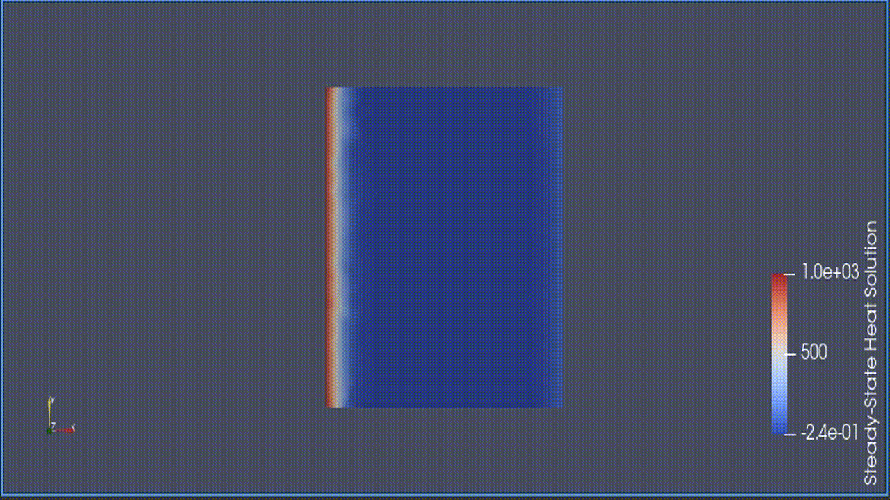

# Mesh PDE Solver

Performs domain decomposition (partitioning of the mesh across multiple processes) via ParMETIS/METIS/Zoltan2,
assembles matrices required to solve some partial differential equation (PDE), and writes out the solution to
the original mesh, which is in Exodus-II Format. Currently only solves the Steady-State Heat Equation, assembling
the necessary matrices in the equation: A X = B

